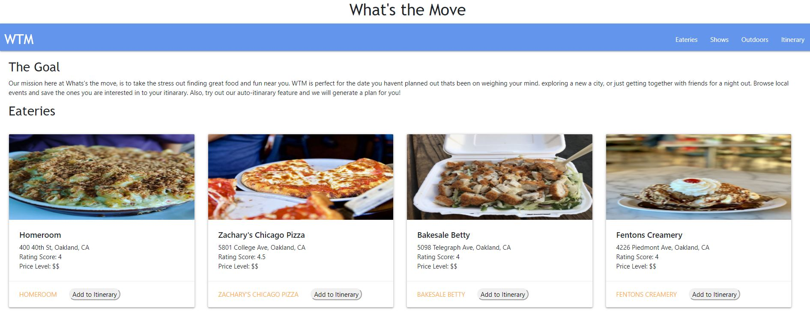
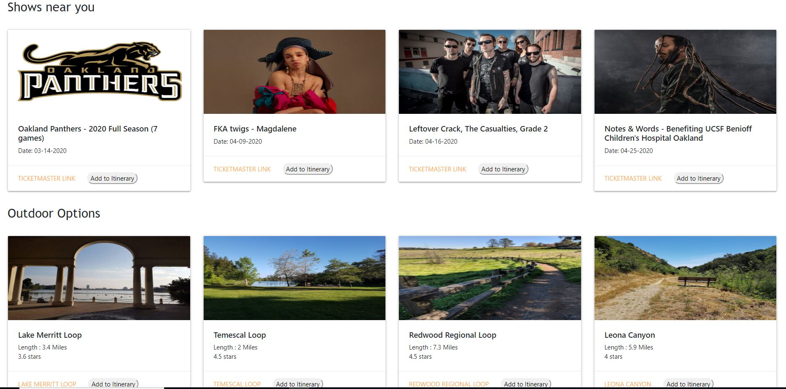

### Team: 
Sin Cho Chan, Erik Adames, David Hughey and Hunter Dean

### Location of URLs
This is the link to the github repo:

 * https://github.com/egadames/whatsNext

This is the link to the live website:

 * https://egadames.github.io/whatsNext/

###Project Planning: 
Our website is the most convenient way to search events going on near you!
Browse restaurants, concerts, and outdoor options all within your city or surrounding area. 

### App's Concept: 
We created our site to make it easy to research outings,
figure out where to eat, or just find a reason to get out of the house and have some fun.

### Process:  
What were the technologies used? 
            we utilized multiple API to source our calendar events and populate our site along with allowing us to append events to a calendar
            
How were tasks and roles broken down and assigned? 
            we each will take charge of an event genre to start ex: food or movies or trails etc.
            
### Technologies used:
- jQuery
- APIs
- HTML
- JavaScript
- Bootstrap CSS

### User Input Page
1. This will load a modal or form that will contain inputs to get information from the user.
2. for the MVP, we shall obtain the location and the date from the user.
3. Validate the user's response will be accepted by APIs and if not require them to complete it collected

### Results Page
1. This page will be created based on the user response.
2. This page will contain a header and 3 rows of activities for the user to select. Each row will contain 3 options from each API. Each activity will be a button that will accessed in the JS and added to favorites or calendar
3. One row will contain information from the Ticketmaster or BandsinTown API that will contain concerts or events occurring near the user provided location.
   a) This information will contain the title of the band or event, location and time as well as price.
4. Another row will contain movies that will happen near the user. 
   a) This information will contain the title of the movie, location and time. If possible, the cost.
5. Another row will contain either restaurants or outdoor options near the user

### Screenshots

